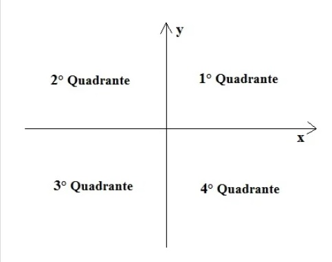

## Quadrante
* Básico
* Princípios Básicos
### Desafio
O plano cartesiano é feito por uma quantidade indeterminada de pontos. Ele é composto por quatro quadrantes como mostra a imagem abaixo. Desenvolva um programa que, dada as coordenadas de entrada (x, y), verifique em qual quadrante está situado o ponto.



Caso uma das coordenadas seja NULA, o programa deve parar.

### Entrada
As entradas serão 2 valores inteiros.

### Saída
Para cada caso de teste mostre em qual quadrante do sistema cartesiano se encontra a coordenada lida, conforme o exemplo.

 
### Exemplo de Entrada	
~~~~
2 2
3 -2
-8 -1
-7 1
0 2
~~~~

Exemplo de Saída
~~~~
primeiro
quarto
terceiro
segundo
~~~~


### Sugestão dada pela plataforma
```java
// Para ler e escrever dados em Java, aqui na DIO padronizamos da seguinte forma:  
// - new Scanner(System.in): cria um leitor de Entradas, com métodos úteis com prefixo "next"; 
// - System.out.println:.imprime um texto de Saída (Output) e pulando uma linha. 
import java.util.Scanner;

public class Program {
    public static void main (String[] args) {
        Scanner reader = new Scanner(System.in);
        int x = reader.nextInt();
        int y = reader.nextInt();

        while (x != 0 && y != 0){
            //TODO: Crie as condições para satisfazer o problema;

            x = reader.nextInt();
            y = reader.nextInt();
        }
    }

}
```
 