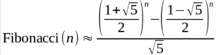

## Fibonacci Rápido

* Básico
* Princípios Básicos

A fórmula de Binet é uma forma de calcular números de Fibonacci.



Sua tarefa é, dado um natural n, calcular o valor de Fibonacci(n) usando a fórmula acima.

### Entrada
A entrada é um número natural n (0 < n ≤ 50).

### Saída
A saída é o valor de Fibonacci(n) com 1 casa decimal utilizando a fórmula de Binet dada.


#### Exemplos de Entrada 1	
~~~~
1
~~~~
#### Exemplos de Saída 1
~~~~
1.0
~~~~
#### Exemplos de Entrada 2
~~~~
2
~~~~
#### Exemplos de Saída 2
~~~~
1.0
~~~~
#### Exemplos de Entrada 3
~~~~
3
~~~~
#### Exemplos de Saída 3
~~~~
2.0
~~~~

Prova 2 (D2) de Programação de Computadores 2016/1 da UNILA


### Sugestão de codigo inicial dado na plataforma

````Java
import java.util.Locale;
import java.util.Scanner;

public class Main {

	public static void main(String[] args) {
		Scanner sc = new Scanner(System.in);
	
     //escreva o seu código aqui

	}
}
````