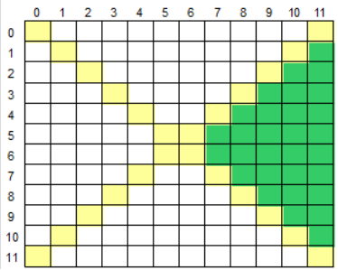

## Área Direita
* Básico
* Princípios Básicos

### Desafio
Leia um caractere maiúsculo, que indica uma operação que deve ser realizada e uma matriz M[12][12]. Em seguida, calcule e mostre a soma ou a média considerando somente aqueles elementos que estão na área direita da matriz, conforme ilustrado abaixo (área verde).

### Entrada
A primeira linha de entrada contem um único caractere Maiúsculo O ('S' ou 'M'), indicando a operação (Soma ou Média) que deverá ser realizada com os elementos da matriz. Seguem os 144 valores de ponto flutuante que compõem a matriz.

### Saída
Imprima o resultado solicitado (a soma ou média), com 1 casa após o ponto decimal.

#### Exemplo de Entrada	
~~~~
S
1.0
330.0
-3.5
2.5
4.1
...
~~~~
#### Exemplo de Saída
~~~~
111.4
~~~~

### TESTES

Teste #1

Dado de entrada:
~~~~
S
155.4 29.9 157.7 56.4 81.9 202.5 217.0 151.5 154.0 72.2 193.1 247.7
133.4 83.8 192.5 142.9 240.1 151.3 230.0 42.7 155.8 114.2 134.6 217.4
235.4 276.4 113.0 111.3 105.7 151.4 85.7 296.0 77.1 140.5 242.4 131.5
274.6 82.8 67.8 26.3 113.4 37.1 291.4 76.9 291.1 285.4 289.1 216.1
254.6 290.8 134.1 104.1 21.5 288.3 237.9 167.1 182.9 250.0 259.8 109.7
110.0 29.1 278.1 116.6 202.0 71.7 219.3 101.9 275.3 65.6 127.9 68.8
279.6 196.3 27.8 206.7 156.7 183.7 85.8 174.6 12.9 90.1 221.5 103.5
74.5 112.4 136.8 90.6 220.0 6.8 242.0 160.2 48.5 137.6 251.3 226.3
39.1 293.3 295.3 12.4 289.6 76.0 160.4 60.8 286.3 41.7 209.4 7.0
158.1 248.9 269.9 186.7 204.6 263.7 288.0 205.1 153.1 69.7 47.5 113.8
6.2 37.8 233.8 113.3 178.0 132.7 193.7 140.6 88.7 256.1 89.0 290.0
295.8 268.4 283.0 74.3 178.1 272.3 16.2 144.5 67.6 202.5 134.1 258.7
~~~~

Saída esperada:
~~~~
4799.5
~~~~

Teste #2

Dado de entrada:
~~~~
S
-19
0
-7
13
-4
46
23
-28
33
-28
-31
25
-9
29
-48
36
7
-8
48
34
-42
31
-11
-41
25
-20
-46
14
34
49
38
-29
36
30
40
36
38
0
10
-41
-8
-21
-7
-46
-24
29
11
-22
4
12
8
-45
19
29
1
-29
-4
-28
-16
-38
14
39
35
-19
16
-12
-20
20
15
5
-37
38
4
4
8
-31
24
22
2
16
47
-48
6
32
18
10
36
-1
-23
46
20
-47
-17
32
-47
-8
9
26
-47
12
26
45
24
-4
8
-46
-29
13
9
48
11
36
-40
18
-28
41
40
47
-34
34
-28
-34
-41
-24
-42
0
48
-26
16
-48
6
26
5
15
-33
-33
-48
-3
-31
-29
-36
-47
-44
10
~~~~
Saída esperada:
~~~~
-15.0
~~~~

Teste #3

Dado de entrada:
~~~~
M
-19
0
-7
13
-4
46
23
-28
33
-28
-31
25
-9
29
-48
36
7
-8
48
34
-42
31
-11
-41
25
-20
-46
14
34
49
38
-29
36
30
40
36
38
0
10
-41
-8
-21
-7
-46
-24
29
11
-22
4
12
8
-45
19
29
1
-29
-4
-28
-16
-38
14
39
35
-19
16
-12
-20
20
15
5
-37
38
4
4
8
-31
24
22
2
16
47
-48
6
32
18
10
36
-1
-23
46
20
-47
-17
32
-47
-8
9
26
-47
12
26
45
24
-4
8
-46
-29
13
9
48
11
36
-40
18
-28
41
40
47
-34
34
-28
-34
-41
-24
-42
0
48
-26
16
-48
6
26
5
15
-33
-33
-48
-3
-31
-29
-36
-47
-44
10
~~~~
Saída esperada:
~~~~
-0.5
~~~~

### Codigo fornecido inicialmente pela DIO

~~~~java
import java.io.IOException;
import java.util.Scanner;

public class  {
	
    public static void main(String[] args) throws IOException {
        Scanner leitor = new Scanner(System.in);
        double soma = 0;
        char O = leitor.next().toUpperCase().charAt(0);
        double[][] M = new double[12][12];
        for (               ) {
        	for (                 ) {
        		M[i][j] = leitor.nextDouble();
        	}
        }
        
        for (                    ) {
        	for (                     ) {
        		if (                  ) soma += M[i][j];
        	}
        }

        if (                     ) soma /= 30;
    	System.out.println(String.format("%.1f", soma));
    }
	
}
~~~~