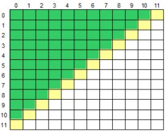

## Acima da Diagonal Secundária

* Básico
* Princípios Básicos

### Desafio

Leia um caractere maiúsculo, que indica uma operação que deve ser realizada e uma matriz M[12][12]. Em seguida, calcule e mostre a soma ou a média considerando somente aqueles elementos que estão acima da diagonal secundária da matriz, conforme ilustrado abaixo (área verde).

### Entrada
A primeira linha de entrada contem um único caractere Maiúsculo O ('S' ou 'M'), indicando a operação (Soma ou Média) que deverá ser realizada com os elementos da matriz. Seguem os 144 valores de ponto flutuante que compõem a matriz.

### Saída

Imprima o resultado solicitado (a soma ou média), com 1 casa após o ponto decimal.

#### Exemplo de Entrada
~~~~
S
1.0
0.0
-3.5
2.5
4.1
...
~~~~
#### Exemplo de Saída
~~~~
12.6
~~~~

### Codigo Inicial Disponibilizado 

~~~java
import java.io.IOException;
import java.util.Scanner;

public class  {

    public static void main(String[] args) throws IOException {
        Scanner leitor = new Scanner(System.in);
        double soma = 0;
        char O = leitor.next().toUpperCase().charAt(0);
        double[][] M = new double[12][12];
        for (                      ) {
        	for (                                         ) {
        		M[i][j] = leitor.nextDouble();
        	}
        }
        
        for (                                        ) {
        	for (                                ) {
        		if (         ) soma += M[i][j];
        	}
        }

        if (            ) soma /= ((M.length * M.length) - 12) / 2; // 66
    	System.out.println(String.format("%.1f", soma));
    }

}
~~~~

### Teste 1

##### Dado de entrada:
~~~~
M
113 11 90 32 115 121 47 120 67 41 52 21
102 69 60 130 108 23 25 68 35 28 29 9
22 88 129 33 19 84 18 136 1 55 54 72
42 143 61 133 118 44 94 122 66 5 132 63
20 45 27 39 126 125 110 96 46 13 24 86
81 15 6 56 123 103 105 135 7 85 79 3
64 139 97 51 31 117 119 62 134 73 101 34
99 2 78 89 82 74 95 75 76 10 87 12
91 128 140 14 71 80 141 100 107 40 50 142
53 114 77 17 59 4 43 30 124 93 92 58
38 36 83 8 144 111 112 48 109 137 26 138
49 65 98 37 131 16 57 127 104 116 70 106
~~~~
##### Saída esperada:
~~~~
73.2
~~~~

### Teste 2

##### Dado de entrada:
~~~~
S
113 11 90 32 115 121 47 120 67 41 52 21
102 69 60 130 108 23 25 68 35 28 29 9
22 88 129 33 19 84 18 136 1 55 54 72
42 143 61 133 118 44 94 122 66 5 132 63
20 45 27 39 126 125 110 96 46 13 24 86
81 15 6 56 123 103 105 135 7 85 79 3
64 139 97 51 31 117 119 62 134 73 101 34
99 2 78 89 82 74 95 75 76 10 87 12
91 128 140 14 71 80 141 100 107 40 50 142
53 114 77 17 59 4 43 30 124 93 92 58
38 36 83 8 144 111 112 48 109 137 26 138
49 65 98 37 131 16 57 127 104 116 70 106
~~~~
##### Saída esperada:
~~~~
4834.0
~~~~

### Teste 3
##### Dado de entrada:
~~~~
S
-19
0
-7
13
-4
46
23
-28
33
-28
-31
25
-9
29
-48
36
7
-8
48
34
-42
31
-11
-41
25
-20
-46
14
34
49
38
-29
36
30
40
36
38
0
10
-41
-8
-21
-7
-46
-24
29
11
-22
4
12
8
-45
19
29
1
-29
-4
-28
-16
-38
14
39
35
-19
16
-12
-20
20
15
5
-37
38
4
4
8
-31
24
22
2
16
47
-48
6
32
18
10
36
-1
-23
46
20
-47
-17
32
-47
-8
9
26
-47
12
26
45
24
-4
8
-46
-29
13
9
48
11
36
-40
18
-28
41
40
47
-34
34
-28
-34
-41
-24
-42
0
48
-26
16
-48
6
26
5
15
-33
-33
-48
-3
-31
-29
-36
-47
-44
10
~~~~
##### Saída esperada:
~~~~
292.0
~~~~

### Teste 4
##### Dado de entrada:
~~~~
M
-19
0
-7
13
-4
46
23
-28
33
-28
-31
25
-9
29
-48
36
7
-8
48
34
-42
31
-11
-41
25
-20
-46
14
34
49
38
-29
36
30
40
36
38
0
10
-41
-8
-21
-7
-46
-24
29
11
-22
4
12
8
-45
19
29
1
-29
-4
-28
-16
-38
14
39
35
-19
16
-12
-20
20
15
5
-37
38
4
4
8
-31
24
22
2
16
47
-48
6
32
18
10
36
-1
-23
46
20
-47
-17
32
-47
-8
9
26
-47
12
26
45
24
-4
8
-46
-29
13
9
48
11
36
-40
18
-28
41
40
47
-34
34
-28
-34
-41
-24
-42
0
48
-26
16
-48
6
26
5
15
-33
-33
-48
-3
-31
-29
-36
-47
-44
10
~~~~
##### Saída esperada:
~~~~
4.4
~~~~

