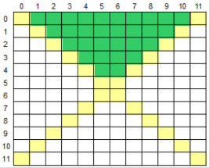

## Área Superior

* Intermediário
* Princípios Básicos

### Desafio

Leia um caractere maiúsculo, que indica uma operação que deve ser realizada e uma matriz M[12][12]. Em seguida, calcule e mostre a soma ou a média considerando somente aqueles elementos que estão na área superior da matriz, conforme ilustrado abaixo (área verde).

### Entrada
A primeira linha de entrada contem um único caractere Maiúsculo O ('S' ou 'M'), indicando a operação (Soma ou Média) que deverá ser realizada com os elementos da matriz. Seguem 144 valores com ponto flutuante de dupla precisão que compõem a matriz.

### Saída
Imprima o resultado solicitado (a soma ou média), com 1 casa após o ponto decimal.

#### Exemplo de Entrada
~~~~
S
1.0
330.0
-3.5
2.5
4.1
...
~~~~
####	Exemplo de Saída
~~~~
112.4
~~~~

### Codigo Inicial Disponibilizado

~~~java
import java.io.IOException;
import java.util.Scanner;

public class {

    public static void main(String[] args) throws IOException {
        Scanner leitor = new Scanner(System.in);
        double soma = 0;
        char O = leitor.next().toUpperCase().charAt(0);
        double[][] M = new double[12][12];
        for (             ) {
        	for (                          ) {
        		
        	}
        }
        
        for (                       ) {
        	for (                                   ) {
        		if (                               ) soma +=           ;
        	}
        }

        if (                 ) soma /=        ;
    	System.out.println(String.format("%.1f", soma));
    }
	
}
~~~~

### Teste 1

##### Dado de entrada:
~~~~
S
1.9
3.8
5.7
7.6
9.5
11.4
13.3
15.2
17.1
19.0
20.9
22.8
24.7
26.6
28.5
30.4
32.3
34.2
36.1
38.0
39.9
41.8
43.7
45.6
47.5
49.4
51.3
53.2
55.1
57.0
58.9
60.8
62.7
64.6
66.5
68.4
70.3
72.2
74.1
76.0
77.9
79.8
81.7
83.6
85.5
87.4
89.3
91.2
93.1
95.0
96.9
98.8
100.7
102.6
104.5
106.4
108.3
110.2
112.1
114.0
115.9
117.8
119.7
121.6
123.5
125.4
127.3
129.2
131.1
133.0
134.9
136.8
138.7
140.6
142.5
144.4
146.3
148.2
150.1
152.0
153.9
155.8
157.7
159.6
161.5
163.4
165.3
167.2
169.1
171.0
172.9
174.8
176.7
178.6
180.5
182.4
184.3
186.2
188.1
190.0
191.9
193.8
195.7
197.6
199.5
201.4
203.3
205.2
207.1
209.0
210.9
212.8
214.7
216.6
218.5
220.4
222.3
224.2
226.1
228.0
229.9
231.8
233.7
235.6
237.5
239.4
241.3
243.2
245.1
247.0
248.9
250.8
252.7
254.6
256.5
258.4
260.3
262.2
264.1
266.0
267.9
269.8
271.7
273.6
~~~~
##### Saída esperada:
~~~~
1282.5
~~~~
### Teste 2

##### Dado de entrada:
~~~~
M
1.9
3.8
5.7
7.6
9.5
11.4
13.3
15.2
17.1
19.0
20.9
22.8
24.7
26.6
28.5
30.4
32.3
34.2
36.1
38.0
39.9
41.8
43.7
45.6
47.5
49.4
51.3
53.2
55.1
57.0
58.9
60.8
62.7
64.6
66.5
68.4
70.3
72.2
74.1
76.0
77.9
79.8
81.7
83.6
85.5
87.4
89.3
91.2
93.1
95.0
96.9
98.8
100.7
102.6
104.5
106.4
108.3
110.2
112.1
114.0
115.9
117.8
119.7
121.6
123.5
125.4
127.3
129.2
131.1
133.0
134.9
136.8
138.7
140.6
142.5
144.4
146.3
148.2
150.1
152.0
153.9
155.8
157.7
159.6
161.5
163.4
165.3
167.2
169.1
171.0
172.9
174.8
176.7
178.6
180.5
182.4
184.3
186.2
188.1
190.0
191.9
193.8
195.7
197.6
199.5
201.4
203.3
205.2
207.1
209.0
210.9
212.8
214.7
216.6
218.5
220.4
222.3
224.2
226.1
228.0
229.9
231.8
233.7
235.6
237.5
239.4
241.3
243.2
245.1
247.0
248.9
250.8
252.7
254.6
256.5
258.4
260.3
262.2
264.1
266.0
267.9
269.8
271.7
273.6
~~~~
##### Saída esperada:
~~~~
42.7
~~~~

### Teste 3

##### Dado de entrada:
~~~~
S
-19
0
-7
13
-4
46
23
-28
33
-28
-31
25
-9
29
-48
36
7
-8
48
34
-42
31
-11
-41
25
-20
-46
14
34
49
38
-29
36
30
40
36
38
0
10
-41
-8
-21
-7
-46
-24
29
11
-22
4
12
8
-45
19
29
1
-29
-4
-28
-16
-38
14
39
35
-19
16
-12
-20
20
15
5
-37
38
4
4
8
-31
24
22
2
16
47
-48
6
32
18
10
36
-1
-23
46
20
-47
-17
32
-47
-8
9
26
-47
12
26
45
24
-4
8
-46
-29
13
9
48
11
36
-40
18
-28
41
40
47
-34
34
-28
-34
-41
-24
-42
0
48
-26
16
-48
6
26
5
15
-33
-33
-48
-3
-31
-29
-36
-47
-44
10
~~~~
##### Saída esperada:
~~~~
165.0
~~~~
### Teste 4

##### Dado de entrada:
~~~~
M
-19
0
-7
13
-4
46
23
-28
33
-28
-31
25
-9
29
-48
36
7
-8
48
34
-42
31
-11
-41
25
-20
-46
14
34
49
38
-29
36
30
40
36
38
0
10
-41
-8
-21
-7
-46
-24
29
11
-22
4
12
8
-45
19
29
1
-29
-4
-28
-16
-38
14
39
35
-19
16
-12
-20
20
15
5
-37
38
4
4
8
-31
24
22
2
16
47
-48
6
32
18
10
36
-1
-23
46
20
-47
-17
32
-47
-8
9
26
-47
12
26
45
24
-4
8
-46
-29
13
9
48
11
36
-40
18
-28
41
40
47
-34
34
-28
-34
-41
-24
-42
0
48
-26
16
-48
6
26
5
15
-33
-33
-48
-3
-31
-29
-36
-47
-44
10
~~~~
##### Saída esperada:
~~~~
5.5
~~~~