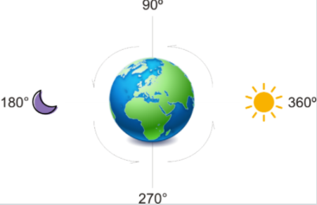

## A Mudança
* Intermediário
* Princípios Básicos

### Desafio

Hermione está criando um novo Vira Tempo especialmente para programadores. É impressionante as vantagens que ele oferece e o conforto pra codar que ele tem. O artefato ainda está em desenvolvimento e ele prometeu consertar os bugs e colocar uns apetrechos melhores e, em troca, pediu um sistema simples para o modo Standy Bay. O problema é que o artefato por si só sempre tem o ângulo de inclinação do Sol/Lua(de 0 a 360). Valendo um Vira Tempo, caso deseja aceitar: dada em grau da inclinação do Sol/Lua, informe em qual período do dia ele se encontra.

### Entrada
A entrada contém um número inteiro M (0 ≤ M ≤ 360) representando o grau do Sol/Lua. Como a posição muda constantemente seu programa receberá diversos casos a cada segundo(EOF).

### Saída
Imprima uma saudação referente ao período do dia que ele se encontra: "Boa Tarde!!", "Boa Noite!!", "Bom Dia!!" e "De Madrugada!!".

#### Exemplo de Entrada
~~~~
0
45
360
90
180
~~~~
#### Exemplo de Saída
~~~~
Bom Dia!!
Bom Dia!!
Bom Dia!!
Boa Tarde!!
Boa Noite!!
~~~~

### Codigo Inicial Disponibilizado

~~~java
import java.io.IOException;
import java.util.Scanner;

public class {

    public static void main(String[] args) throws IOException {
    	Scanner leitor = new Scanner(System.in);
    	while (leitor.hasNext()) {
    		int graus = leitor.nextInt();
    		if (                                ) System.out.println("Bom Dia!!");
    		

    		else System.out.println("Bom Dia!!");
    	}
    }
    
}
~~~~

### Teste 1

##### Dado de entrada:
~~~~
360
359
1
90
~~~~
##### Saída esperada:
~~~~
Bom Dia!!
De Madrugada!!
Bom Dia!!
Boa Tarde!!
~~~~

### Teste 2

##### Dado de entrada:
~~~~
0
45
90
135
180
225
270
315
360
~~~~
##### Saída esperada:
~~~~
Bom Dia!!
Bom Dia!!
Boa Tarde!!
Boa Tarde!!
Boa Noite!!
Boa Noite!!
De Madrugada!!
De Madrugada!!
Bom Dia!!
~~~~

### Teste 3

##### Dado de entrada:
~~~~
360
0
89
90
179
180
269
270
359
~~~~
##### Saída esperada:
~~~~
Bom Dia!!
Bom Dia!!
Bom Dia!!
Boa Tarde!!
Boa Tarde!!
Boa Noite!!
Boa Noite!!
De Madrugada!!
De Madrugada!!
~~~~