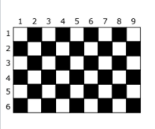

## Xadrez
* Básico
* Princípios Básicos
  
### Desafio
No tabuleiro de xadrez, a casa na linha 1, coluna 1 (canto superior esquerdo) é sempre branca e as cores das casas se alternam entre branca e preta, formando o formato tão conhecido como xadrez. Dessa forma, como o tabuleiro tradicional tem oito linhas e oito colunas, a casa na linha 8, coluna 8 (canto inferior direito) será também branca. Porém, neste problema, queremos ser capazes de predizer a cor independente do número de linhas e colunas, sendo: L linhas e C colunas. No exemplo da figura, para L = 6 e C = 9, a casa no canto inferior direito será preta, uma simples previsão matemática, não?



### Entrada
A primeira linha da entrada contém um inteiro L (1 ≤ L ≤ 1000) indicando o número de linhas do tabuleiro.
A segunda linha da entrada contém um inteiro C (1 ≤ C ≤ 1000) representando o número de colunas.

### Saída
Imprima uma linha na saída. A linha deve conter um inteiro, representando a cor da casa no canto inferior direito do tabuleiro, e para identificar, considere o inteiro 1 para a cor branca e 0 para a cor preta.


#### Exemplos de Entrada 1	
~~~~
6
9
~~~~
#### Exemplos de Saída 1
~~~~
0
~~~~
#### Exemplos de Entrada 2
~~~~
8
8
~~~~
#### Exemplos de Saída 2
~~~~
1
~~~~
#### Exemplos de Entrada 3
~~~~
5
91
~~~~
#### Exemplos de Saída 3
~~~~
1
~~~~

### Código inicial dado pela plataforma dio
````java
import java.util.Scanner;
public class Main {
	public static void main(String[] args) {
        Scanner sc = new Scanner(System.in);

        int L = sc.nextInt();
        int C = sc.nextInt();
        if ((     )     ==0)
            System.out.println("   ");
        else                                               //complete o código nos espaços em branco
            System.out.println("   ");
        sc.close();
	}
}
````
 

