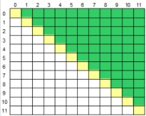

## Acima da Diagonal Principal
* Intermediário
* Princípios Básicos
Leia um caractere maiúsculo, que indica uma operação que deve ser realizada e uma matriz M[12][12]. Em seguida, calcule e mostre a soma ou a média considerando somente aqueles elementos que estão acima da diagonal principal da matriz, conforme ilustrado abaixo (área verde).

### Entrada
A primeira linha de entrada contem um único caractere Maiúsculo O ('S' ou 'M'), indicando a operação (Soma ou Média) que deverá ser realizada com os elementos da matriz. Seguem os 144 valores de ponto flutuante que compõem a matriz.

### Saída
Imprima o resultado solicitado (a soma ou média), com 1 casa após o ponto decimal.

#### Exemplo de Entrada	
~~~~
S
1.0
0.0
-3.5
2.5
4.1
...
~~~~
#### Exemplo de Saída
~~~~
12.6
~~~~

#### Teste #1

Dado de entrada:
~~~~
S
-19
0
-7
13
-4
46
23
-28
33
-28
-31
25
-9
29
-48
36
7
-8
48
34
-42
31
-11
-41
25
-20
-46
14
34
49
38
-29
36
30
40
36
38
0
10
-41
-8
-21
-7
-46
-24
29
11
-22
4
12
8
-45
19
29
1
-29
-4
-28
-16
-38
14
39
35
-19
16
-12
-20
20
15
5
-37
38
4
4
8
-31
24
22
2
16
47
-48
6
32
18
10
36
-1
-23
46
20
-47
-17
32
-47
-8
9
26
-47
12
26
45
24
-4
8
-46
-29
13
9
48
11
36
-40
18
-28
41
40
47
-34
34
-28
-34
-41
-24
-42
0
48
-26
16
-48
6
26
5
15
-33
-33
-48
-3
-31
-29
-36
-47
-44
10
~~~~
Saída esperada:
~~~~
121.0
~~~~

Teste #2

Dado de entrada:
~~~~
M
-19
0
-7
13
-4
46
23
-28
33
-28
-31
25
-9
29
-48
36
7
-8
48
34
-42
31
-11
-41
25
-20
-46
14
34
49
38
-29
36
30
40
36
38
0
10
-41
-8
-21
-7
-46
-24
29
11
-22
4
12
8
-45
19
29
1
-29
-4
-28
-16
-38
14
39
35
-19
16
-12
-20
20
15
5
-37
38
4
4
8
-31
24
22
2
16
47
-48
6
32
18
10
36
-1
-23
46
20
-47
-17
32
-47
-8
9
26
-47
12
26
45
24
-4
8
-46
-29
13
9
48
11
36
-40
18
-28
41
40
47
-34
34
-28
-34
-41
-24
-42
0
48
-26
16
-48
6
26
5
15
-33
-33
-48
-3
-31
-29
-36
-47
-44
10
~~~~
Saída esperada:
~~~~
1.8
~~~~
