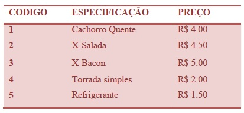

## Lanche
* Básico
* Princípios Básicos
Com base na tabela abaixo, escreva um programa que leia o código de um item e a quantidade deste item. A seguir, calcule e mostre o valor da conta a pagar.

### Entrada
O arquivo de entrada contém dois valores inteiros correspondentes ao código e à quantidade de um item conforme tabela acima.

### Saída
O arquivo de saída deve conter a mensagem "Total: R$ " seguido pelo valor a ser pago, com 2 casas após o ponto decimal.



#### Exemplo de Entrada 1	
~~~~
3 2
~~~~
#### Exemplo de Saída 1
~~~~
Total: R$ 10.00
~~~~
#### Exemplo de Entrada 2
~~~~
4 3
~~~~
#### Exemplo de Saída 2
~~~~
Total: R$ 6.00
~~~~
#### Exemplo de Entrada 3	
~~~~
2 3
~~~~
#### Exemplo de Saída 3
~~~~
Total: R$ 13.50
~~~~

### Sugestão inicial de programa
````Java
import java.util.Scanner;

public class Teste {

	public static void main(String[] args) {
		int X, Y;
		float preco = 0;
		
		Scanner input = new Scanner(System.in);
		X = input.nextInt();
		Y = input.nextInt();
		if (X == 1) {
			preco  = (float) (4.00 * Y);
		}else if (X == 2) {
			preco  = (float) (     * Y);  //implemente sua lógica aqui
		}else if (X == 3) {
			preco  = (float) (     );  //implemente sua lógica aqui 
		}else if (X == 4) {
			preco  = (float) (     ); //implemente sua lógica aqui
		}else if (X == 5) {
			preco  = (float) (    ); //implemente sua lógica aqui
		}
		
		System.out.printf("Total: R$ %.2f\n",preco);
	}

}
````